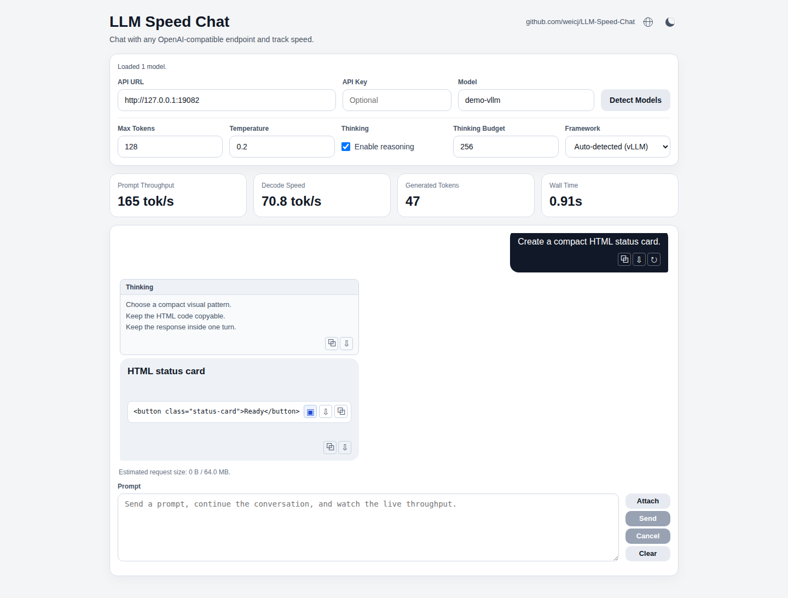

# LLM Speed Chat

A small single-user OpenAI-compatible chat UI for measuring interactive LLM serving speed against local or remote endpoints.



The point of this project is not to provide a production service. The point is to give one person a fast local harness that feels like a real user talking to an agent, while surfacing the metrics that matter during that interaction:

- End-to-end prompt throughput
- Average decode speed
- End-to-end wall time
- Generated token count

## Scope

This project is intentionally scoped as a single-user benchmark tool that runs locally in the browser and can target a local server or a hosted API.

It keeps the parts that help simulate real back-and-forth use:

- multi-turn chat history
- streamed assistant output
- cancel and clear controls
- automatic model discovery from `API URL`
- draft recovery after failed sends

It does not aim to be:

- a production API gateway
- a multi-user shared chat service
- an ingress-ready deployment target
- an observability or orchestration surface

## Quick Start

Installed package:

```bash
python3 -m pip install dist/*.whl
llm-speed-chat --help
llm-speed-chat
```

From source:

```bash
python3 -m pip install -e .
llm-speed-chat --version
llm-speed-chat
```

Common CLI overrides:

```bash
llm-speed-chat \
  --upstream-base-url http://127.0.0.1:8000 \
  --model your-model-id \
  --port 8080
```

From the repository root:

```bash
python3 server.py
```

Or:

```bash
./run.sh
```

Then open `http://127.0.0.1:8080`.

The common local path is:

```bash
UPSTREAM_BASE_URL=http://127.0.0.1:8000
UPSTREAM_API_KEY=
MODEL=
```

If you prefer a container for local use:

```bash
docker build -t llm-speed-chat .
docker run --rm -p 8080:8080 \
  --add-host host.docker.internal:host-gateway \
  -e UPSTREAM_BASE_URL=http://host.docker.internal:8000 \
  llm-speed-chat
```

Or:

```bash
docker compose up --build
```

Docker and Compose are optional wrappers. The local Python entrypoint is still the main path.

## Workflow

After the page loads:

1. Enter the upstream API base URL in the `API URL` field.
   The field accepts a plain host like `127.0.0.1:8000`, a base URL like `http://127.0.0.1:8000`, or a pasted OpenAI-style path like `http://127.0.0.1:8000/v1`.
2. The UI auto-detects models from `/v1/models` and fills the first model automatically.
3. Start chatting.

The `Detect Models` button is only a manual retry fallback.

If the upstream requires authentication, enter an API key in the UI or set:

```bash
UPSTREAM_API_KEY=sk-demo
```

For OpenAI-compatible upstreams, the tool sends it as `Authorization: Bearer <key>`.

If your upstream does not expose `/v1/models`, type the model ID manually or set `MODEL` in the environment.

For comparable token rates, the tool requests the standard streaming `usage` object. It measures elapsed time in the browser, so Wall Time covers the complete user-visible request path through stream completion.

The Framework selector is populated when models are detected. In its default automatic mode, the model's `owned_by` metadata selects llama.cpp, vLLM, SGLang, ExLlama, or Universal once; sending a chat request does not re-detect the server.

- `llama.cpp` requests its request-scoped token IDs and timing fields, including streamed `prompt_n` and `predicted_n` when that is the available exact source.
- `vLLM` requests request-scoped prompt and streamed output token IDs.
- `SGLang` requests its continuous streaming `usage` statistics; its chat endpoint does not accept `return_token_ids` while streaming.
- `ExLlama` follows its OpenAI-compatible server's standard usage contract. TabbyAPI does not expose request-scoped token IDs in chat streams.
- `Universal` sends only standard OpenAI-compatible fields and is the appropriate choice for hosted or unrecognized APIs.

When exact streaming counts are not available, the three token metrics update from a browser-side provisional count prefixed with `~`. A standard `usage` object, when returned, replaces it with the exact unprefixed value. Wall Time is always browser-measured and is updated continuously until the request ends or is cancelled.

## What Stays

- Real multi-turn chat, not single-shot requests
- Streaming output with browser-timed endpoint-neutral metrics
- Core speed metrics in the main UI
- Request cancellation
- Text-first request-size guardrails so the local UI fails fast before oversized sends

## Configuration

Minimal `.env`:

```bash
UPSTREAM_BASE_URL=http://127.0.0.1:8000
UPSTREAM_API_KEY=
MODEL=
HOST=127.0.0.1
PORT=8080
TITLE=LLM Speed Chat
```

Optional tuning:

```bash
DEFAULT_MAX_TOKENS=512
DEFAULT_TEMPERATURE=0.2
MAX_REQUEST_BYTES=67108864
UPSTREAM_MODEL_TIMEOUT_S=20
UPSTREAM_CHAT_TIMEOUT_S=3600
```

## Package Build

Build a wheel and source distribution:

```bash
python3 -m pip install build
python3 -m build
```

Smoke the built wheel locally:

```bash
python3 -m pip install dist/*.whl
python3 scripts/smoke-installed.py
```

Release checklist:

```bash
sed -n '1,200p' RELEASE.md
```

Changelog:

```bash
sed -n '1,120p' CHANGELOG.md
```

One-command release smoke:

```bash
./scripts/check-release.sh
```

Release metadata audit:

```bash
python3 scripts/audit-release-metadata.py --strict
```

## Tests

Python tests:

```bash
python3 -m unittest discover -s tests -v
```

Browser tests:

```bash
npm ci
npx playwright install --with-deps chromium
npm run test:e2e
```

The Playwright suite runs the real Python app against a mock upstream and covers model discovery, multi-turn chat, streaming metrics, cancellation, upstream retry timing, and request-size guardrails in Chromium.

CI exercises the tool in three distribution shapes: editable install, built wheel, and container image.
